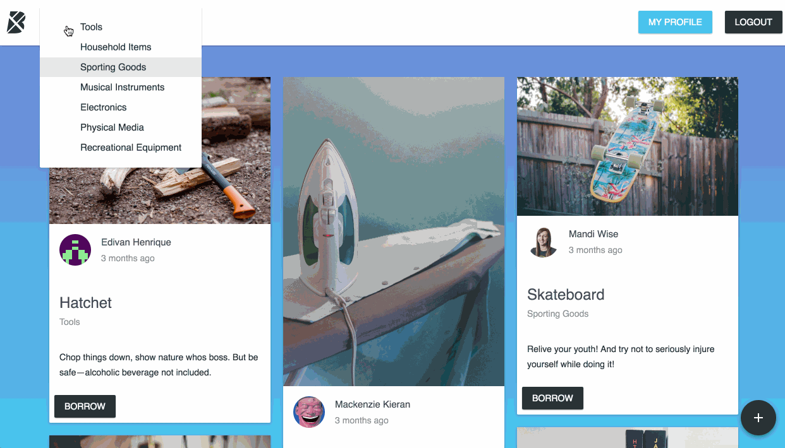
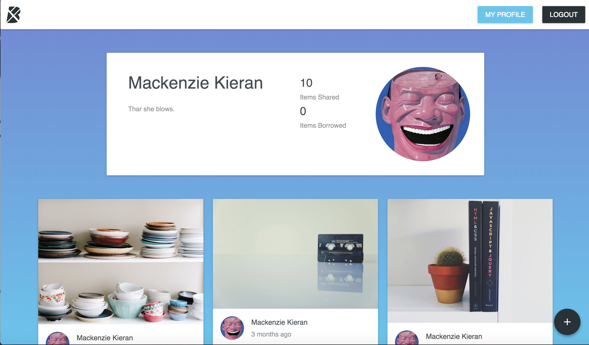
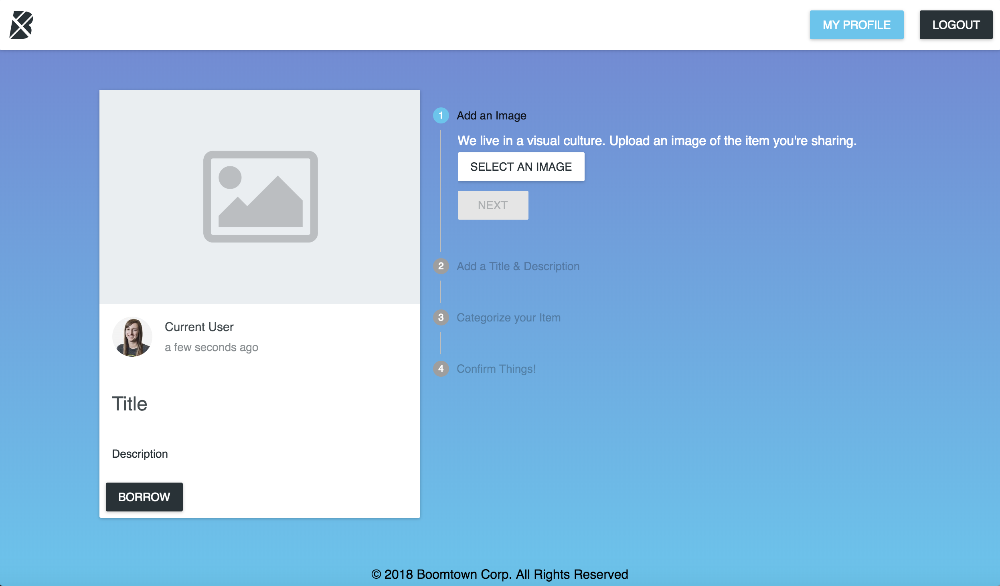
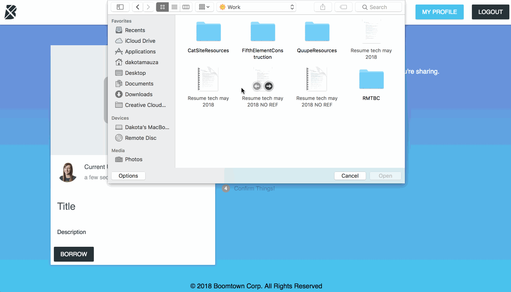

# BoomTown

A web app to share items among users built using React with Redux for state management. The database is built using Postgres for items and Firebase for users and images, and uses Node.js with Express. The front end uses Apollo Client and GraphQL for data fetching.

## Resources

Material UI:
Used for all main styling of the app, including the item cards and profile papers.
http://www.material-ui.com/#/

React-Masonry-Component:
Used to get the Masonry grid style layout for the items.
https://www.npmjs.com/package/react-masonry-component

Moment JS:
Used for time stamps on item cards.
https://momentjs.com/

React-Gravatar:
Used to connect the Gravatar picture using each user's email.
https://github.com/KyleAMathews/react-gravatar

Final Form:
Used for share item form.
https://github.com/final-form/final-form

## Set Up Instructions

1.  Download ZIP with project files.
2.  Run `npm install` inside /client folder.
3.  Run `npm install` inside /server folder.
4.  Run `npm run dev` inside /server folder.
5.  Run `npm start` inside /client folder.
